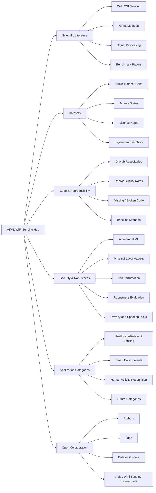
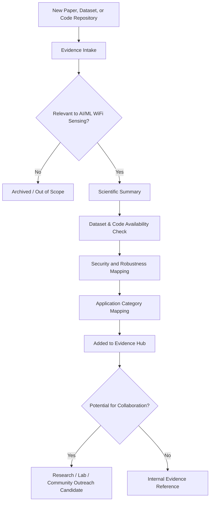

# AI/ML WiFi Sensing Hub

  <strong>An open research hub mapping AI/ML WiFi sensing papers, datasets, code, reproducibility, and security gaps, starting with healthcare-relevant sensing.</strong>

  
  
  
  

---

## Overview

The **AI/ML WiFi Sensing Hub** is an open research mapping initiative focused on organizing scientific evidence around **WiFi sensing systems powered by artificial intelligence and machine learning**.

The hub maps research papers, datasets, code releases, reproducibility notes, security relevance, and open research gaps across WiFi-based sensing applications. The first focus area is **healthcare-relevant sensing**, including contactless monitoring, activity recognition, fall detection, respiration estimation, and care-aware environments.

The long-term goal is to make the AI/ML WiFi sensing research landscape easier to understand, compare, reproduce, and extend.

---

## Research Motivation

WiFi sensing has shown promise for detecting and interpreting human activity, motion, respiration, presence, and environment-level changes without requiring wearable devices or cameras. AI/ML methods are increasingly used to classify patterns, estimate signals, and support higher-level sensing applications from WiFi channel information.

However, the field still faces important challenges:

- Dataset availability and comparability
- Code availability and reproducibility
- Model robustness under noise, domain shift, and environmental change
- Security risks at the wireless and physical layers
- Privacy and spoofing concerns
- Lack of standardized evaluation across tasks and environments
- Limited connection between sensing failures and real-world application risks

This hub is designed to organize that evidence in a structured, transparent, and collaboration-friendly way.

---

## Current Focus Area: Healthcare-Relevant WiFi Sensing

The first category in this hub focuses on **healthcare-relevant and care-aware WiFi sensing**, including:

- Fall detection
- Activity recognition
- Respiration monitoring
- Vital-sign-related sensing
- Aging-in-place research
- Assisted-living environments
- Non-invasive monitoring studies
- Safety-aware sensing evaluation

This project does not claim clinical validation or medical-device readiness. The focus is research evidence mapping, reproducibility, security analysis, and trustworthy AI/ML sensing methods.

---

## Future Expansion Areas

While healthcare-relevant sensing is the first category, this hub is designed to grow into other AI/ML WiFi sensing areas, such as:

| Future Category | Example Topics |
|---|---|
| Smart Environments | Occupancy, room-level activity, behavior patterns |
| Human Activity Recognition | Gesture, movement, posture, daily activities |
| Security and Privacy | Spoofing, adversarial attacks, physical-layer risks, privacy leakage |
| Robotics and Interaction | Device-free interaction, localization, environment awareness |
| Industrial and IoT Sensing | Presence detection, monitoring, automation, anomaly detection |
| Reproducible WiFi Sensing | Public datasets, baselines, code releases, benchmark design |

---

## Project Direction

| Direction | Purpose |
|---|---|
| Scientific Evidence Mapping | Curate and classify papers, datasets, methods, and open gaps in AI/ML WiFi sensing |
| Healthcare-Relevant Sensing | Track evidence related to contactless monitoring, fall detection, respiration, and care-aware environments |
| Trustworthy AI/ML Sensing | Track robustness, reproducibility, and model-evaluation limitations across existing work |
| Wireless Security Analysis | Identify adversarial, physical-layer, spoofing, perturbation, and privacy-related risks |
| Open Collaboration | Create a structured place for researchers, labs, and practitioners to suggest related work, datasets, and code |

---

## Visual Research Scope

---

## Evidence Workflow

---

## Evidence Categories

| Category | Purpose |
|---|---|
| Core Research Evidence | Papers that strongly shape the technical direction of AI/ML WiFi sensing |
| Healthcare-Relevant WiFi Sensing | Work on contactless sensing for activity, fall detection, respiration, vital signs, and care-aware environments |
| Security and Robustness Evidence | Papers on adversarial attacks, defenses, spoofing, perturbation, privacy, and physical-layer risks |
| Dataset Evidence | Public datasets, access status, licensing, modalities, endpoints, and suitability for experiments |
| Code and Reproducibility Evidence | Available repositories, reproducibility notes, baseline implementations, and missing-code gaps |
| Future Application Categories | Research connected to smart environments, human activity recognition, IoT sensing, robotics, and other WiFi sensing areas |
| Collaboration Leads | Authors, labs, datasets, and groups whose work may connect to this hub |

---

## Intended Audience

This project is designed for researchers and practitioners working across:

- AI/ML for WiFi sensing
- WiFi CSI and wireless sensing
- Healthcare-relevant sensing
- Cybersecurity and adversarial machine learning
- Reproducible research
- Aging technology and assisted-living research
- Contactless monitoring systems
- Smart environments and IoT sensing
- Trustworthy AI for sensing applications

---

## Collaboration Invitation

Suggestions are welcome for:

- Relevant papers
- Public datasets
- Code repositories
- Reproducibility notes
- Missing but important related work
- Security or robustness gaps
- Research groups or labs working in related areas
- New application categories for AI/ML WiFi sensing

Future GitHub issue templates will provide a structured way to suggest papers, datasets, code resources, and collaboration ideas.

---

## Research Disclaimer

This project is a research evidence hub. It does **not** claim clinical validation, medical-device readiness, real patient deployment, regulatory approval, or diagnostic capability.

The focus is scientific evidence mapping, reproducibility, security analysis, and trustworthy AI/ML sensing methods for WiFi-based sensing applications.

---

## Current Status

This hub is under active development as a structured research resource for AI/ML WiFi sensing, starting with healthcare-relevant and care-aware sensing applications.
