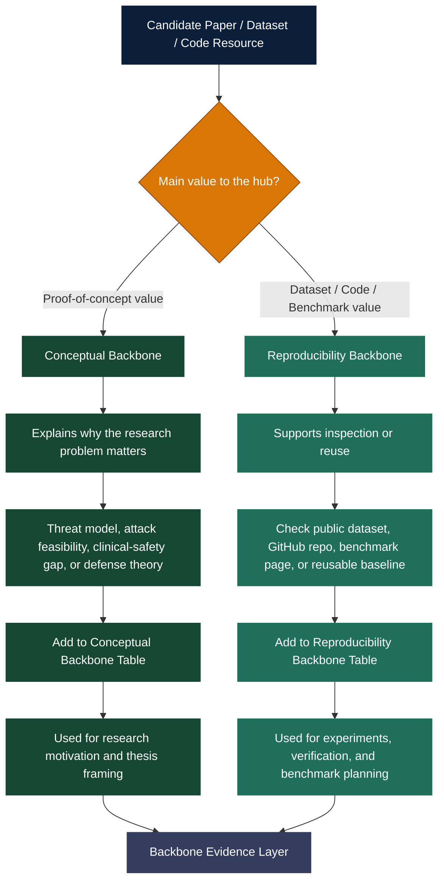

---

## Review Workflow

---

## How to Read This Workflow

The review workflow separates two kinds of backbone evidence:

| Path | Meaning |
|---|---|
| **Conceptual Backbone** | Papers that prove the research problem is real or justify the technical direction |
| **Reproducibility Backbone** | Papers, datasets, benchmarks, or GitHub repositories that help verify claims or support experiments |

The goal is to avoid mixing **proof-of-concept evidence** with **reproducible experiment resources**. Both are important, but they serve different roles in the hub.
