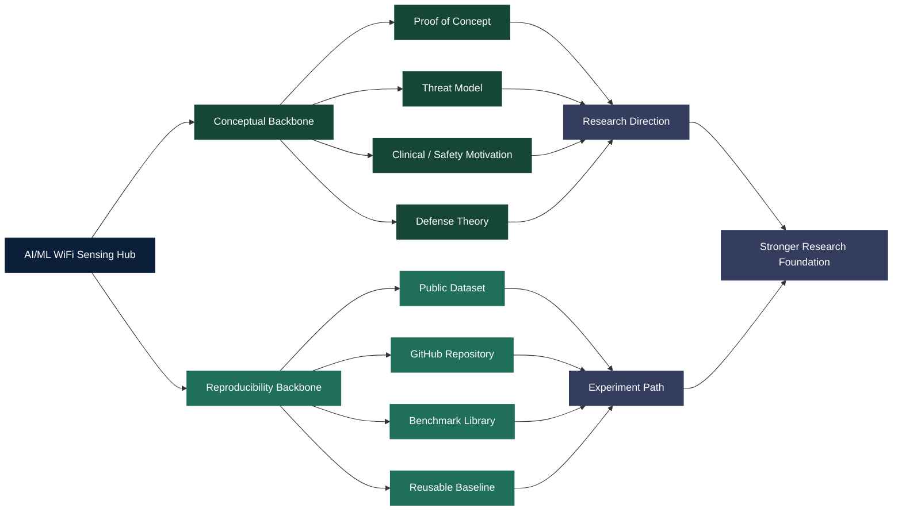
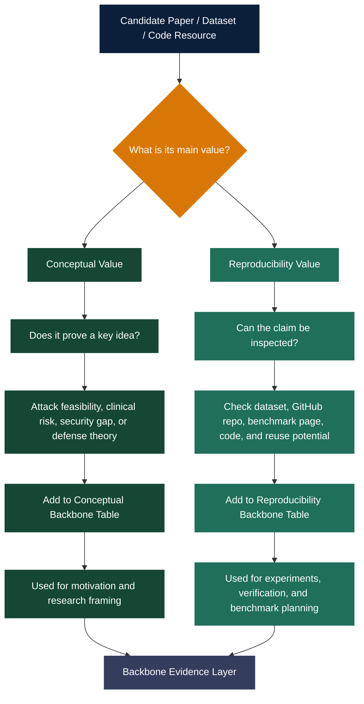

---

## Backbone Evidence Model

The backbone layer is organized around two complementary evidence types. The first group explains **why the research problem is scientifically important**. The second group explains **how claims can be inspected, reproduced, or tested**.

---

## Backbone Review Workflow

Each candidate paper or resource is reviewed based on its main value to the hub.

---

## How to Read This Page

This page is not a simple bibliography. It separates backbone evidence into two layers:

| Layer | Reader should understand |
|---|---|
| Conceptual Backbone | These papers justify the research direction and show that the problem is real |
| Reproducibility Backbone | These resources provide datasets, GitHub repositories, benchmarks, or reusable materials that can help verify claims |

A strong research project needs both. Conceptual papers explain the scientific motivation. Reproducibility resources make the project inspectable, testable, and useful to other researchers.
